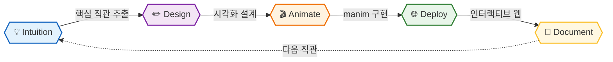

# See Why

**We make you see why.**  
**Complex concepts visualized — so the answer feels inevitable, not memorized.**

 

> *"The goal is not to explain. The goal is to make you feel it was obvious all along."*

---

## 🎯 Philosophy

수식을 외우는 것과, 왜 그 수식이 그 모양일 수밖에 없는지 아는 것은 다릅니다.

이 연구소는 **직관(Intuition)** 을 전달하는 것을 목표로 합니다.  
푸리에 변환이 왜 원운동의 합인지, Attention이 왜 QKᵀV 형태일 수밖에 없는지,  
소수가 왜 저런 분포를 가지는지 — 보고 나면 **당연하게 느껴지도록.**

모든 시각화는 세 가지 기준으로 선정됩니다.

| 기준 | 설명 |
|------|------|
| **중요도** | 이걸 모르면 다른 개념이 안 열리는 것 |
| **직관 난이도** | 수식은 알아도 왜인지 모르는 것 |
| **시각화 가능성** | 움직임으로 "아하!" 순간을 만들 수 있는 것 |

---

## 📚 Visualizations

### 🔢 Mathematics — Analysis & Algebra

> 수학의 본질적인 구조를 공간과 움직임으로

| 📌 Topic | 💡 Core Intuition | 🔗 |
|:---------|:-----------------|:---|
| **Fourier Transform** | 왜 모든 신호는 원운동의 합인가 — 주파수를 원 위에서 보기 | [📂](https://github.com/see-why-lab/fourier-transform) |
| **Euler's Formula** | e^iπ+1=0 이 왜 성립하는가 — 복소평면 위의 회전 | [📂](https://github.com/see-why-lab/eulers-formula) |
| **Eigenvectors** | 행렬 변환의 본질 — 공간이 늘어날 때 방향만 유지되는 벡터 | [📂](https://github.com/see-why-lab/eigenvectors) |
| **Linear Transformation** | 행렬 곱이 공간을 어떻게 뒤트는가 — 격자로 보는 변환 | [📂](https://github.com/see-why-lab/linear-transformation) |
| **Convolution** | 합성곱의 수학적 의미 — 두 함수가 겹치며 쓸려가는 것 | [📂](https://github.com/see-why-lab/convolution-math) |
| **Taylor Series** | 왜 모든 함수는 다항식으로 근사되는가 — 접선의 반복 | [📂](https://github.com/see-why-lab/taylor-series) |
| **Gradient & Topology** | 경사, 등고선, 방향미분의 기하학적 의미 | [📂](https://github.com/see-why-lab/gradient-and-topology) |
| **Fermat's Little Theorem** | 왜 a^p ≡ a (mod p)인가 — 군론으로 보는 증명 | [📂](https://github.com/see-why-lab/fermat-little-theorem) |
| **Prime Distribution** | 소수는 왜 저렇게 분포하는가 — 리만 가설 직관 | [📂](https://github.com/see-why-lab/prime-distribution) |
| **Euclidean GCD** | 유클리드 알고리즘이 왜 GCD를 구하는가 | [📂](https://github.com/see-why-lab/gcd-euclidean) |

 

### 📊 Mathematics — Probability & Statistics

> 불확실성의 수학적 구조를 직관적으로

| 📌 Topic | 💡 Core Intuition | 🔗 |
|:---------|:-----------------|:---|
| **Bayes' Theorem** | 왜 사후확률이 그렇게 바뀌는가 — 넓이로 보는 베이즈 | [📂](https://github.com/see-why-lab/bayes-theorem) |
| **Central Limit Theorem** | 왜 어떤 분포든 더하면 정규분포가 되는가 | [📂](https://github.com/see-why-lab/central-limit-theorem) |
| **Law of Large Numbers** | 수렴이 왜 보장되는가 — 확률의 물리적 의미 | [📂](https://github.com/see-why-lab/law-of-large-numbers) |
| **Markov Chain** | 상태 전이가 수렴하는 이유 — 고유벡터로 보는 정상분포 | [📂](https://github.com/see-why-lab/markov-chain) |

 

### ⚙️ Algorithms

> 왜 이 알고리즘이 정답을 보장하는가

| 📌 Topic | 💡 Core Intuition | 🔗 |
|:---------|:-----------------|:---|
| **Dynamic Programming** | 최적 부분구조가 왜 성립하는가 — 상태 전이 시각화 | [📂](https://github.com/see-why-lab/dynamic-programming) |
| **Dijkstra** | 왜 Greedy가 최단경로를 보장하는가 | [📂](https://github.com/see-why-lab/dijkstra) |
| **FFT** | DFT를 O(n²)에서 O(n log n)으로 — 분할정복의 마법 | [📂](https://github.com/see-why-lab/fft) |
| **Sorting Lower Bound** | 왜 비교 기반 정렬의 하한이 O(n log n)인가 | [📂](https://github.com/see-why-lab/sorting-lower-bound) |

 

### 🤖 AI Theory

> 왜 이 구조가 이러한 성능을 내는가 — 근본적 이해

| 📌 Topic | 💡 Core Intuition | 🔗 |
|:---------|:-----------------|:---|
| **Attention Mechanism** | QKV가 왜 그 형태인가 — 내적이 유사도인 이유 | [📂](https://github.com/see-why-lab/attention-mechanism) |
| **Backpropagation** | 체인룰이 연산 그래프 위에서 어떻게 흐르는가 | [📂](https://github.com/see-why-lab/backpropagation) |
| **Gradient Descent** | Loss Landscape를 실제로 걸어 내려가는 시각화 | [📂](https://github.com/see-why-lab/gradient-descent) |
| **Universal Approximation** | 왜 신경망은 어떤 함수도 근사하는가 | [📂](https://github.com/see-why-lab/neural-network-universal) |
| **Softmax & Entropy** | softmax가 왜 확률이 되는가 — 엔트로피와의 연결 | [📂](https://github.com/see-why-lab/softmax-and-entropy) |
| **SVD & PCA** | 데이터의 본질적인 축 찾기 — 분산 최대화의 기하학 | [📂](https://github.com/see-why-lab/svd-pca) |
| **Diffusion Intuition** | 왜 노이즈를 추가했다 빼는 것이 생성이 되는가 | [📂](https://github.com/see-why-lab/diffusion-intuition) |
| **Positional Encoding** | Transformer의 sin/cos가 왜 위치를 표현하는가 | [📂](https://github.com/see-why-lab/transformer-positional) |

💡 각 레포는 manim 애니메이션 코드 + 인터랙티브 웹 데모를 포함합니다.

---

## 🛠️ How We Work

| Step | Description |
|------|-------------|
| 💡 **Intuition** | "왜?"라는 질문에서 시작 — 핵심 직관 한 문장으로 정의 |
| ✏️ **Design** | 어떤 움직임이 그 직관을 전달하는가 설계 |
| 🎬 **Animate** | manim으로 수학적으로 정확한 애니메이션 구현 |
| 🌐 **Deploy** | 같은 개념을 인터랙티브 웹 데모로 구현 |
| 📝 **Document** | 수식·코드·직관을 함께 정리 |

---

## 🔧 Tech Stack

| 도구 | 용도 |
|------|------|
| **manim** | 수학 애니메이션 영상 제작 (3Blue1Brown 사용 라이브러리) |
| **p5.js** | 인터랙티브 웹 시각화 |
| **three.js** | 3D 개념 시각화 |
| **d3.js** | 데이터 기반 시각화 |

---

## 💡 Philosophy

> **"The best teachers don't simplify.**  
> **They find the perspective from which complexity becomes obvious."**

---

## 🔗 Related

*개발 기술의 구현 원리는 IQ Dev Lab에서,  
AI의 수학적 증명은 IQ AI Lab에서 탐구합니다.*

 

**⭐️ 도움이 되셨다면 Star를 눌러주세요!**

